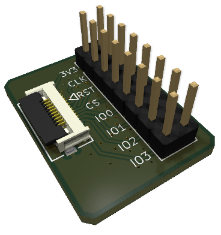

# Odroid H5 eSPI bus research

This project explores the eSPI bus traffic on Odroid-H5 board between Intel N300 SoC and `it8613e` SuperIO chip.

# eSPI breakout PCB
H5 board conveniently provies a header for a flex cable carrying `CLK`, `CS`, `RST`, `IO[0:3]` signals,
that can be accessed by making a simple breadkout board (available in [pcb](./pcb)).

Parts:
 - [10 position FFC header](https://www.digikey.com/en/products/detail/molex/5051101092/5700458)
 - [short FFC cable](https://www.digikey.com/en/products/detail/molex/0150200096/2817185) (opposite side contacts for convenience)
 - [any 16 pin 2.54 pitch header](https://www.digikey.com/en/products/detail/harwin-inc/M20-9760846/3727785)
